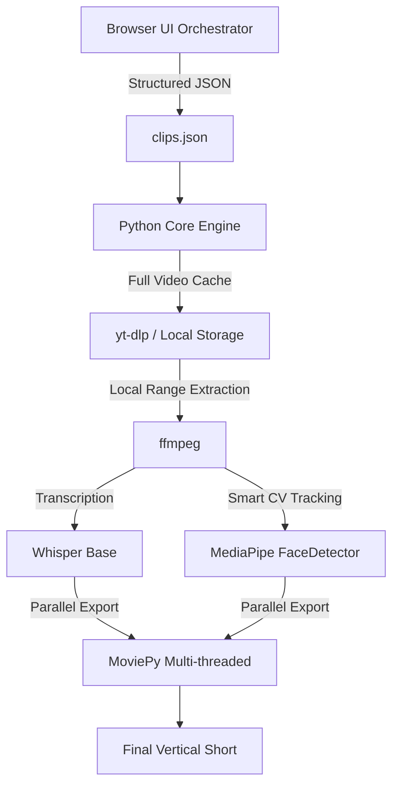

# Architecture Overview

fypd follows a decoupled architecture to separate heavy media processing from lightweight AI orchestration.

## System Diagram

## Components

### 1. UI Orchestrator (Tauri + React)
- **Security:** BYOK (Bring Your Own Key) for Gemini API, stored in `localStorage`.
- **Logic:** Queries Gemini to analyze video transcripts and output a structured timeline.
- **Real-Time Monitoring:** Dual progress tracking system. Pipes real-time download and rendering percentages from the backend to the glassmorphic `ProcessingPhaseTracker`.
- **Incremental Display:** Decoupled clip lifecycle. Finished clips are displayed and interactive while the rest of the job queue is still processing.

### 2. Python Core Engine (`viral_clipper.py`)
- **Ingestion Layer:** Implements **Anti-Throttling Logic**. Downloads the full video once to a local cache and performs high-speed local extraction via `ffmpeg`.
- **Intelligence Layer:** 
    - **Turbo-Transcription:** Uses OpenAI Whisper `base` model for accurate, high-speed audio-to-text.
    - **Smart-Tracking:** Implemented neural frame-skipping (Detect every 5th frame) with EMA cinematic interpolation to reduce CV CPU overhead by 80%.
- **Media Layer:** Multi-threaded MoviePy compositor utilizing all available CPU cores for final master compilation.
- **Robust Repurposing Fallback:** Automatically switches to full-video Whisper transcription if YouTube subtitles are unavailable, ensuring 100% reliability for the ghostwriting engine.

## Data Flow
1. **Input:** User provides a YouTube URL.
2. **Analysis:** Gemini identifies "viral" segments and defines crop modes/zooms.
3. **Blueprint:** A JSON timeline is generated.
4. **Processing:** The Python script reads the JSON, downloads fragments, transcribes audio, and renders the final 9:16 video.
