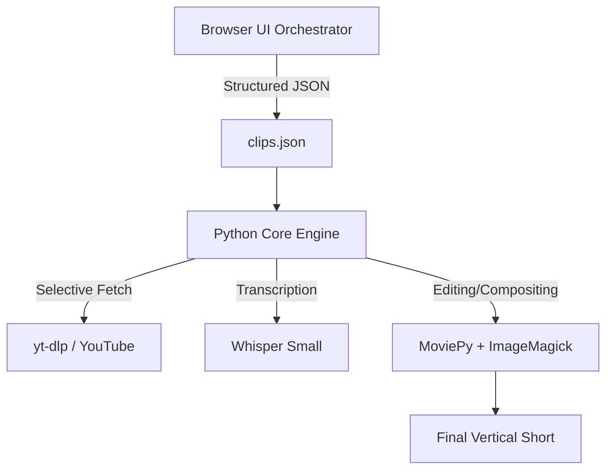

# Architecture Overview

fypd follows a decoupled architecture to separate heavy media processing from lightweight AI orchestration.

## System Diagram

## Components

### 1. UI Orchestrator (Tauri + React)
- **Security:** BYOK (Bring Your Own Key) for Gemini API, stored in `localStorage`.
- **Logic:** Queries Gemini to analyze video transcripts and output a structured timeline.
- **Output:** Generates the `clips.json` file that drives the local engine.
- **Environment Handoff:** The Tauri Rust binary injects the `FYPD_DATA_DIR` environment variable into the Python backend on startup, ensuring the unified application writes all output files and logs to a safe `%LOCALAPPDATA%` environment without requiring Administrator privileges.
- **OTA Updates:** The React UI utilizes `@tauri-apps/plugin-updater` to silently check GitHub Releases on startup. Updates are cryptographically verified using a baked-in Ed25519 public key before being applied via the NSIS background hook.

### 2. Python Core Engine (`viral_clipper.py`)
- **Network Layer:** Uses `yt-dlp`'s byte-range feature to stream only specific segments of the video.
- **Intelligence Layer:** Uses `OpenAI Whisper` for word-level timestamps and transcription.
- **Media Layer:** Uses `MoviePy` for cropping, resizing, and concatenating clips.
- **Typography Layer:** A custom kinetic animation module that creates dual-layered text for high-retention visuals.

## Data Flow
1. **Input:** User provides a YouTube URL.
2. **Analysis:** Gemini identifies "viral" segments and defines crop modes/zooms.
3. **Blueprint:** A JSON timeline is generated.
4. **Processing:** The Python script reads the JSON, downloads fragments, transcribes audio, and renders the final 9:16 video.
